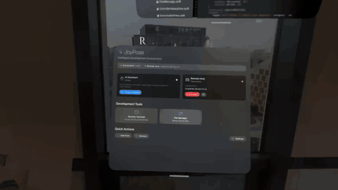

<p align="center">
  
</p>

<h1 align="center">JoyPose</h1>

<p align="center">
  <strong>Ditch the keyboard. Vibe code in spatial computing.</strong>
</p>

<p align="center">
  
  
  
  
</p>

<p align="center">
  <a href="README_ZH.md">中文文档</a>
</p>

---

JoyPose is a native visionOS app that replaces your keyboard and mouse with a game controller for AI-powered coding. When you connect to your Mac via Virtual Desktop in visionOS, the input experience breaks — you're back to physical peripherals in a spatial world. JoyPose fixes that by letting you drive your entire development workflow through a joystick, right inside Vision Pro.

Built at **[VibeHacks #01](https://lu.ma/vibehacks)** hackathon in Beijing, September 2025.

## Demo

> JoyPose running on Apple Vision Pro — SSH terminal, file manager, AI agent conversation, and game controller input, all in spatial windows.

<p align="center">
  
</p>

<p align="center">
  <a href="https://github.com/BingoWon/joy-pose/raw/main/docs/demo.mp4">📥 Watch full demo video (MP4)</a>
</p>

## The Problem

visionOS is a keyboard-and-mouse-free operating system — you interact with eyes, hands, and voice. But the moment you open Virtual Desktop to code on your Mac, you need a keyboard and mouse again. This creates a jarring disconnect in the spatial computing experience, especially for AI-assisted "vibe coding" where most of your interaction is conversational.

## The Solution

JoyPose bridges this gap by providing:

- **A native visionOS remote development environment** — SSH terminal, SFTP file manager, and code editor, all in spatial windows
- **AI Agent integration** — Direct communication with [Roo Code](https://github.com/RooVetGit/Roo-Code) (Cline) via WebSocket, with full support for 30 message types and streaming responses
- **Game controller as primary input** — DualSense controller mapped to terminal commands, navigation, and AI interactions

## Features

### 🖥️ Multi-Window Spatial Workspace
Four independent visionOS windows that float in your space:
- **Control Panel** — Connection management and system overview
- **Remote Terminal** — Full SSH terminal with command history and quick commands
- **File Manager** — VSCode-style dual-pane browser with SFTP operations
- **AI Agents** — Roo Code conversation interface with streaming support

### 🤖 AI Agent Protocol
Complete implementation of the Roo Code / Cline messaging protocol:
- 30 message types (14 Ask + 16 Say) fully mapped
- Custom VisionSync WebSocket protocol with handshake and keepalive
- Real-time streaming message rendering
- Task lifecycle management

### 🎮 Game Controller Integration
DualSense controller fully mapped for development workflows:
- Thumbsticks for navigation and scrolling
- Face buttons for execute / cancel / backspace / menu
- Triggers and bumpers for mode switching
- Real-time input visualization and haptic feedback

### 📝 Code Editor
Professional editing powered by Runestone:
- Syntax highlighting for 15 languages via TreeSitter
- 60+ file type recognition
- Line numbers, language auto-detection

### 🔍 Service Discovery
Automatic LAN scanning to find Roo Code instances:
- Concurrent scanning of 254 addresses (custom async semaphore)
- HTTP discovery protocol with WebSocket upgrade
- Auto-reconnection logic

## Architecture

```
JoyPoseApp
├── MainControlView ── Dashboard, SSH host management
├── RemoteTerminalView ── SSH sessions + ornament toolbar
├── RemoteFileManagerView ── SFTP browse / edit / upload
└── AIAgentsView ── Roo Code agent conversation
    │
    ├── Network ── WebSocketClient, NetworkScanner, RooCodeConnectionManager
    ├── SSH ── Citadel SSH/SFTP, SSHTerminalSession, RemoteHostManager
    ├── AI ── AIConversationManager, MessageManager, MessageFactory
    ├── Editor ── Runestone + TreeSitter (15 languages), LanguageMapper
    └── Input ── GameController framework, DualSense full-channel mapping
```

## Tech Stack

| Layer | Technology |
|-------|-----------|
| Platform | visionOS 2.0+, SwiftUI, Swift 5.9+ |
| SSH / SFTP | [Citadel](https://github.com/orlandos-nl/Citadel) |
| Code Editor | [Runestone](https://github.com/simonbs/Runestone) |
| Syntax Highlighting | [TreeSitterLanguages](https://github.com/simonbs/TreeSitterLanguages) (15 grammars) |
| Networking | URLSession WebSocket, Combine, Swift Concurrency |
| Input | GameController.framework (DualSense) |
| UI | visionOS ornaments, glass materials, multi-window |

## Getting Started

### Requirements
- Xcode 16+
- visionOS 2.0+ SDK
- Apple Vision Pro (or visionOS Simulator)
- A Mac running [Roo Code](https://github.com/RooVetGit/Roo-Code) on the same LAN

### Build & Run
```bash
git clone https://github.com/BingoWon/joy-pose.git
cd joy-pose
open "Joy Pose.xcodeproj"
```
Select the visionOS target and run on your device or simulator.

## Status

This project was built during a 48-hour hackathon and is **no longer actively maintained**. It serves as a proof of concept for controller-driven spatial development workflows.

## License

[MIT](LICENSE)

## Author

**Bin Wang** · [thebinwang.com](https://thebinwang.com) · [GitHub](https://github.com/BingoWon)
