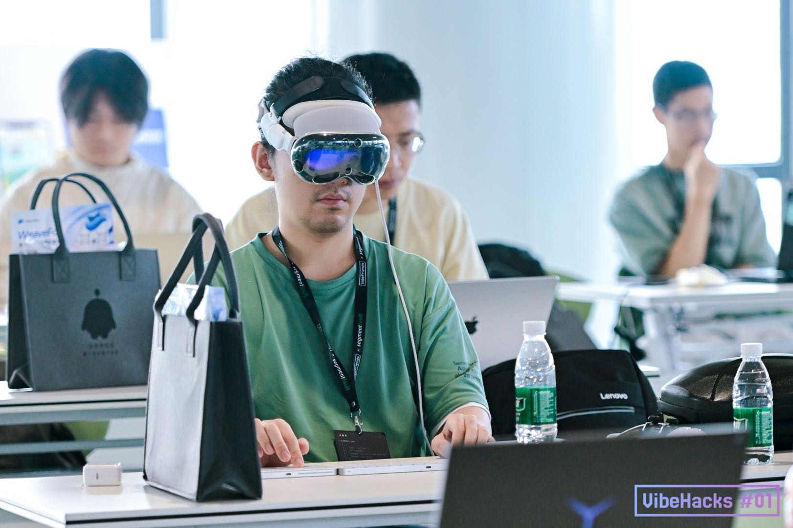

<p align="center">
  
</p>

<h1 align="center">JoyPose</h1>

<p align="center">
  <strong>扔掉键盘，在空间计算中 Vibe Coding。</strong>
</p>

<p align="center">
  
  
  
  
</p>

<p align="center">
  <a href="README.md">English</a>
</p>

---

JoyPose 是一个 visionOS 原生应用，用游戏手柄取代键盘鼠标，在 Vision Pro 中完成 AI 辅助编程。

在 visionOS 中通过虚拟桌面连接 Mac 时，输入体验会割裂——明明是一个不需要键盘鼠标的空间操作系统，却不得不回到传统外设。JoyPose 的理念很简单：既然 Vibe Coding 的核心交互是与 AI 对话，那完全可以用手柄驱动整个开发流程，彻底留在 visionOS 原生交互中。

2025 年 9 月于北京 **[VibeHacks #01](https://lu.ma/vibehacks)** 黑客松开发。

## 演示

> JoyPose 在 Apple Vision Pro 上的实际运行效果——SSH 终端、文件管理器、AI Agent 对话、游戏手柄输入，均以独立空间窗口呈现。

<video src="https://github.com/BingoWon/joy-pose/raw/main/docs/demo.mp4" controls width="100%"></video>

## 解决什么问题

visionOS 天生不需要键盘鼠标——你用眼睛、手势和语音与系统交互。但一旦打开虚拟桌面连接 Mac 进行编程，就必须拿回键盘鼠标，空间计算的沉浸感瞬间被打破。

对于 AI 辅助的 Vibe Coding 场景来说，这种割裂尤为明显——你的主要交互其实是和 AI 对话、审阅代码、确认执行，完全可以通过更轻量的输入方式完成。

## 怎么解决

JoyPose 提供了三层能力：

- **visionOS 原生远程开发环境** — SSH 终端、SFTP 文件管理器、代码编辑器，以空间窗口形式独立存在
- **AI Agent 协议集成** — 通过 WebSocket 直接与 [Roo Code](https://github.com/RooVetGit/Roo-Code)（Cline）通信，完整支持 30 种消息类型和流式响应
- **游戏手柄作为主输入** — DualSense 手柄映射到终端命令、导航和 AI 交互

## 功能特性

### 🖥️ 多窗口空间工作台
四个独立的 visionOS 窗口，悬浮在你的空间中：
- **控制面板** — 连接管理和系统状态总览
- **远程终端** — 完整的 SSH 终端，支持命令历史和快捷命令
- **文件管理器** — VSCode 风格双栏浏览器，支持 SFTP 上传/下载/删除
- **AI Agents** — Roo Code 对话界面，支持流式消息渲染

### 🤖 AI Agent 协议
完整实现 Roo Code / Cline 消息协议：
- 30 种消息类型（14 种 Ask + 16 种 Say）全量映射
- 自定义 VisionSync WebSocket 协议，含握手和心跳保活
- 流式消息实时渲染
- 任务生命周期管理

### 🎮 游戏手柄集成
DualSense 手柄全通道映射：
- 摇杆控制导航和滚动
- 面板按键映射执行/取消/退格/菜单
- 扳机和肩键用于模式切换
- 实时输入状态可视化 + 触觉反馈

### 📝 代码编辑器
基于 Runestone 的专业编辑体验：
- TreeSitter 驱动的 15 种语言语法高亮
- 60+ 种文件类型识别
- 行号显示、语言自动检测

### 🔍 服务发现
局域网自动扫描 Roo Code 实例：
- 自定义异步信号量，254 地址并发扫描
- HTTP 发现协议 + WebSocket 连接升级
- 断线自动重连

## 架构

```
JoyPoseApp
├── MainControlView ── 仪表盘、SSH 主机管理
├── RemoteTerminalView ── SSH 会话 + ornament 浮动工具栏
├── RemoteFileManagerView ── SFTP 浏览 / 编辑 / 上传
└── AIAgentsView ── Roo Code AI Agent 对话
    │
    ├── 网络层 ── WebSocketClient、NetworkScanner、RooCodeConnectionManager
    ├── SSH 层 ── Citadel SSH/SFTP、SSHTerminalSession、RemoteHostManager
    ├── AI 层 ── AIConversationManager、MessageManager、MessageFactory
    ├── 编辑器 ── Runestone + TreeSitter（15 种语言）、LanguageMapper
    └── 输入层 ── GameController 框架、DualSense 全通道映射
```

## 技术栈

| 层级 | 技术 |
|------|------|
| 平台 | visionOS 2.0+、SwiftUI、Swift 5.9+ |
| SSH / SFTP | [Citadel](https://github.com/orlandos-nl/Citadel) |
| 代码编辑器 | [Runestone](https://github.com/simonbs/Runestone) |
| 语法高亮 | [TreeSitterLanguages](https://github.com/simonbs/TreeSitterLanguages)（15 种语法） |
| 网络通信 | URLSession WebSocket、Combine、Swift Concurrency |
| 输入设备 | GameController.framework（DualSense） |
| 界面 | visionOS ornaments、玻璃材质、多窗口 |

## 快速开始

### 环境要求
- Xcode 16+
- visionOS 2.0+ SDK
- Apple Vision Pro（或 visionOS 模拟器）
- 同一局域网内运行 [Roo Code](https://github.com/RooVetGit/Roo-Code) 的 Mac

### 构建运行
```bash
git clone https://github.com/BingoWon/joy-pose.git
cd joy-pose
open "Joy Pose.xcodeproj"
```
选择 visionOS 目标设备，编译运行即可。

## 项目状态

本项目在 48 小时黑客松期间开发完成，**已停止维护**，作为手柄驱动空间开发工作流的概念验证。

## 开源协议

[MIT](LICENSE)

## 作者

**王斌** · [thebinwang.com](https://thebinwang.com) · [GitHub](https://github.com/BingoWon)
